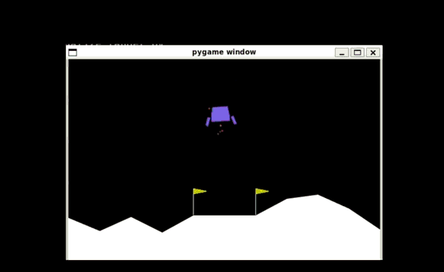

# PPO Lunar Lander Training

Progetto del corso di Robotica: applicazione dell’algoritmo PPO (Proximal Policy Optimization) per risolvere il task di controllo continuo in Gymnasium LunarLanderContinuous-v3.



## Struttura del progetto

```
ppo_lunar_lander_robotics_course/
├── train_lander.py           # Script di training
├── visualize_lander.py       # Visualizzazione agente addestrato
├── requirements.txt          # Dipendenze Python            
├── LICENSE.md                # Licenza MIT
├── .gitignore
├── .gitattributes    
├── README.md                 
```

## Requisiti

- Sistema operativo:
  - Linux (consigliato)
  - Windows con WSL (Windows Subsystem for Linux)
- Python 3.10 o superiore
- pip 

## Installazione

### Opzione 1: Installazione Locale

```bash
git clone https://github.com/mattiafornari/ppo_lunar_lander_robotics_course.git
cd ppo_lunar_lander_robotics_course

sudo apt update && sudo apt install -y python3-pip python3-venv swig
python3 -m venv venv
source venv/bin/activate 

pip install -r requirements.txt
```

## Utilizzo

### Training

**Locale:**
```bash
python train_lander.py
```

L'addestramento dura massimo 30 minuti (anche di meno) su CPU moderna e genera:
- File `ppo_lunar_lander.zip` contenente `policy.optmizer.pth`, `policy.optmizer.pth`, `pytorch\_variables.pth` e altri secondo Stable-Baselines3.

Lo script prevede inoltre una breve fase di testing e valutazione (Evaluation). 
In particolare, esegue l'inferenza del modello addestrato su 5 episodi di test. L'agente viene eseguito in modalità deterministica (i.e. senza esplorazione) per verificare la stabilità della traiettoria appresa e la capacità di generalizzazione. Data Logging: raccoglie la telemetria (coordinate X/Y, velocità) per generare i seguenti grafici:
- Grafico traiettorie: `trajectory_plot.png`
- Grafico spazio delle fasi: `phase_portrait.png`

Si nota che mediante Intel Core i7-14700 il training ha impiegato circa 20 minuti.

### Monitoraggio con TensorBoard

**Locale:**
```bash
tensorboard --logdir tensorboard_logs/
```
Aprire il browser presso `http://localhost:6006` per visualizzare l'andamento del training.

### Visualizzazione

Dopo l'addestramento, è possibile visualizzare l'agente in azione:

**Locale:**
```bash
python visualize_lander.py
```
## Parametri Addestramento

| Parametro | Valore | Descrizione |
|-----------|--------|-------------|
| Algoritmo | PPO | Proximal Policy Optimization |
| Learning Rate | 3e-4 | Learning Rate |
| Steps per Update | 2048 | Passi raccolti prima di ogni aggiornamento della policy |
| Batch Size | 64 | Dimensione minibatch per SGD |
| Epochs | 10 | Numero epoche |
| Gamma | 0.99 | Fattore di sconto |
| GAE Lambda | 0.95 | Parametro GAE per la stima del vantaggio |
| Clip Range | 0.2 | Range di clipping PPO |
| Entropy Coefficient | 0.01 | Coefficiente di entropia |
| Total Timesteps | 2,000,000 | Passi totali dell'addestramento |

## Architettura della rete

- Tipo: Multi-Layer Perceptron (MLP) default Stable-Baselines3
- Strati nascosti: [64, 64] (default Stable-Baselines3)
- Funzione di attivazione: tanh
- Spazio delle osservazioni: 8 dimensioni
- Spazio delle azioni: 2 dimensioni (continuo)
- Input: vettore di stato 8-D
- Output: un vettore che rappresenta la media della distribuzione Gaussiana per le azioni, e uno scalare V (s) ∈ R che stima il valore dello stato corrente (il ritorno atteso, ovvero la somma scontata dei reward futuri)

Si nota che questa configurazione è una baseline: MLP [64,64] con Tanh. Sono possibili miglioramenti significativi mediante hyperparameter tuning (e.g., learning rate, ent_coef, n_steps, batch_size, normalizzazione delle osservazioni etc.) e tramite riprogettazione della policy (e.g., ReLU/Swish, reti più profonde o ampie, separazione policy/value etc.).

## Metriche 

- Ricompensa media > 200: Ambiente risolto (vedere il sito https://gymnasium.farama.org/environments/box2d/lunar_lander/)
- Ricompensa attesa: 250-280 dopo convergenza
- Velocità di atterraggio < 0.5 m/s
- Atterraggio entro il landing pad

## Analisi Output

### Grafico traiettorie

Il grafico mostra le traiettorie spaziali dell'agente su 5 episodi di validazione. Un agente ben addestrato presenta:
- Approccio controllato al landing pad (x ≈ 0)
- Riduzione graduale dell'altitudine
- Punti di atterraggio concentrati vicino al centro

### Grafico spazio delle fasi

Il grafico rappresenta la relazione altezza-velocità verticale (y-vy). Comportamento atteso:
- Velocità di discesa moderata ad alta quota
- Decelerazione progressiva in prossimità del suolo e dunque del pad
- Velocità vicina a zero all'atterraggio

## Risoluzione dei problemi

### Errore: Box2D non installato

```bash
# Ubuntu/Debian
sudo apt-get install swig
pip install gymnasium[box2d]

# macOS
brew install swig
pip install gymnasium[box2d]
```

### Errore: Modello non trovato in visualize_lander.py

Verificare che `ppo_lunar_lander.zip` esista nella directory corrente.
La cartella zip menzionata viene creata da `train_lander.py` nel momento in cui l'addestramento termina.

### TensorBoard mostra grafici vuoti

Attendere qualche minuto dall'avvio del training. I primi dati vengono scritti dopo circa 2048 step. Si rammenta che TensorBoard si aggiorna ogni 30 secondi di default.

## Riferimenti

- Paper PPO: [Proximal Policy Optimization Algorithms](https://arxiv.org/abs/1707.06347)
- Stable-Baselines3: [Documentazione](https://stable-baselines3.readthedocs.io/)
- Gymnasium: [LunarLander-v3](https://gymnasium.farama.org/environments/box2d/lunar_lander/)

## Autori

- **Mattia Fornari** - [@mattiafornari](https://github.com/mattiafornari)
- **Luca Pugnetti** - [@username](https://github.com/username)

## Licenza

Distribuito sotto licenza MIT. Vedere il file `LICENSE` per ulteriori dettagli.

## Contatti

Per segnalazioni o domande aprire una issue su GitHub o contattare via mail.
